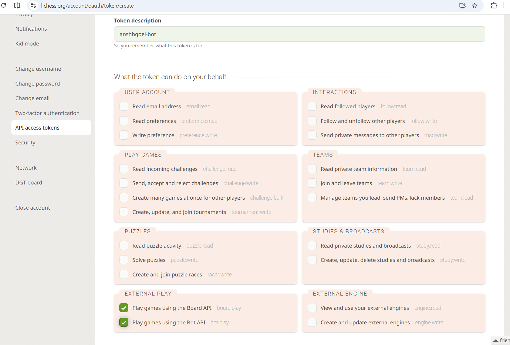

# Play Against Yourself: Personalized Chess AI

This project allows you to train a neural network to play chess exactly like you do. It fetches your historical games from Chess.com, processes them into spatial tensors, and fine-tunes the Leela Chess Zero (Lc0) architecture (using Maia Chess base weights) to mimic your specific human playstyle. 

You can play against your "digital clone" locally via a custom GUI, or connect it to Lichess as an active bot to accept challenges from your friends.

## Key Features
* **Smart PGN Caching:** Automatically downloads and caches your historical Chess.com games efficiently, only fetching new data when necessary.
* **Custom Protobuf Decoder:** Includes a hand-written Python decoder to unpack raw `.pb.gz` Maia weights directly into PyTorch, eliminating the need for complex C++ or Protobuf package dependencies.
* **Stockfish Blunder Filter:** During both local and online play, Stockfish evaluates the neural network's top candidate moves in the background. If the AI's first choice is a massive blunder, the filter vetoes it and plays a safer candidate move instead.
* **Lichess API Integration:** Connects your trained PyTorch model directly to Lichess using the `berserk` library to play games online, supporting multiple concurrent matches via multithreading.

---

## Architecture Overview

This bot utilizes a **Leela Chess Zero (Lc0)** network architecture, which is configured specifically to replicate human playstyles (commonly referred to as the MaiaNet architecture). For more information on the science behind this approach, you can read the original [Maia Chess research paper (arXiv:2006.01855)](https://arxiv.org/pdf/2006.01855).


Unlike Stockfish, which calculates millions of possible moves ahead using a massive search tree to find the mathematically perfect move, this bot uses a **Policy Network**. It looks at the current board position and instantly evaluates: *"In this exact position, what would a human player most likely do?"* It outputs a percentage probability for every possible move, and the bot simply picks the legal move with the highest percentage.

Because your bot is trained on human games, it will play moves that make logical sense to a human eye. It will play beautiful positional chess, but it will also occasionally miss tricky tactical combinations or blunder under pressure—making it an incredibly fun and realistic opponent to play against!

---

## How to Run

### 1. Installation
First, clone this repository to your local machine:
```bash
git clone <this-repository-url>
cd <this-repository-name>
uv sync
```
*(Note: To train on an NVIDIA GPU on Windows, you must install the CUDA version of PyTorch: `uv pip install --reinstall torch --index-url https://download.pytorch.org/whl/cu121`)*

### 2. External Dependencies
Before running, you need to add one external file to your directory:
1. **Maia Base Weights:** Download the `maia-1100.pb.gz` base model from the [Maia Chess GitHub Releases](https://github.com/CSSLab/maia-chess/releases) and place it in a `base_models/` folder.


*(Note: The Stockfish engine used for the blunder filter is already included in the `stockfish/` folder, so there is no need to download it manually!)*

### 3. Pipeline Execution
Open `config.py` and change `USERNAME` to your Chess.com username. Then run the pipeline in this order:

1. **`fetch_games.py`**: Fetches your game history into a PGN file by hitting the chess.com API for archived months and merging them.
2. **`analyse_games.py`**: *(Optional)* Analyzes your top starting moves, average moves per game, win rates, and average opponent rating.
3. **`prepare_training.py`**: Parses the PGN, filters anomalies (short games, incorrect time controls), and encodes the board states into 112-plane spatial tensors.
4. **`train.py`**: Loads the Maia weights and fine-tunes the network on your games using PyTorch on your GPU.

### 4. Play!
* **Offline:** Run `gui_play.py` to play against your bot in a local Tkinter window.
* **Online:** You will need to create an API token on Lichess.


Create a `.env` file with `LICHESS_API_TOKEN=your_token_here` and run `lichess_bot.py` to accept challenges on Lichess.

---

## Deep Dive: How the Code Works

If you want to understand the inner workings of the machine learning pipeline, here is a detailed breakdown of the core scripts.

### prepare_training.py
This script is the data preparation pipeline. Neural networks cannot read standard chess notation; they need everything converted into numbers. This script takes human chess games, filters them, translates the board states into complex mathematical grids (tensors), translates the moves into "target" predictions, and packages everything up into compressed chunks for the model to study.

* **`board_to_planes`**: Converts a board position into a 3D grid of 1s and 0s (a 112x8x8 tensor). It visually rotates the board 180 degrees if the AI is playing as Black so the network always evaluates moving pieces "forward". It maps out pawns, knights, bishops, rooks, queens, kings, en passant targets, castling rights, and game length rules across the 112 planes.
* **`move_to_policy`**: Translates the actual move played in the game into a prediction target. It looks up the move in an 1858-class dictionary and outputs a "One-Hot" array containing a single 1.0 at the exact index of the correct move.
* **`extract_positions`**: Steps through valid games move-by-move, extracting the board state (planes), the move made (policy), and the final game outcome (winner) to create a dataset.
* **Random Shuffling**: The script shuffles all extracted positions before saving them. This ensures the AI sees a random endgame, then a random opening, forcing it to judge the board purely on the merits of the position rather than memorizing a specific sequence.

### train.py
This script is the heart of the machine learning pipeline. It takes the binary tensors generated in the preparation phase and feeds them through a specialized Deep Convolutional Residual Neural Network (ResNet).

* **ResidualBlock & MaiaNet**: The network uses 6 residual blocks and 64 channels. Residual blocks use skip connections to prevent the "vanishing gradient" problem in deep networks. The architecture splits into a Policy Head (to predict the human's exact move) and a Value Head (to predict the game's final outcome).
* **Multi-Task Loss**: The engine calculates two different errors at the same time. The Policy Loss (Cross Entropy) compares the predicted move with the actual move. The Value Loss (Mean Squared Error) compares the predicted win rate against the actual game result.
* **Label Smoothing**: Instead of demanding 100% confidence in the correct move, label smoothing reallocates a small percentage of probability across other moves. This prevents over-fitting and helps the model learn general human chess play patterns instead of perfectly memorizing individual positions.

### lichess_bot.py
This script takes your fully trained neural network and connects it to the Lichess servers using your API token to play games against real humans in real-time.

* **`get_model_move`**: Translates the current Lichess board into a 112-layer mathematical grid, feeds it through the neural network, converts the raw output numbers into percentages (softmax), cross-references the predictions with actual legal chess moves to prevent hallucinations, and returns the legal move with the highest confidence score.
* **Multithreading**: When a game starts, the script spins up a separate background process (`threading.Thread`) for that specific game. This means your bot can theoretically handle hundreds of different games at the exact same time without them freezing each other (limited only by your computer's GPU processing speed).
* **Automated Bouncer**: The bot constantly listens to the Lichess lobby. If a user sends a challenge for a standard game of chess, it automatically accepts. It will automatically decline non-standard variants like Crazyhouse or Chess960.
